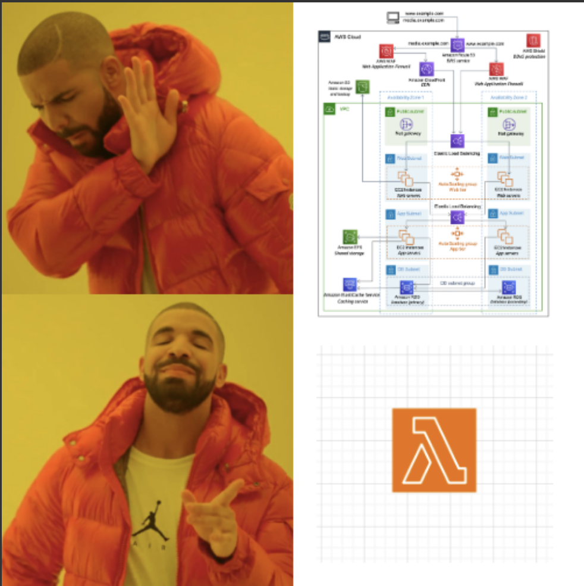

<h1 align="center">
  <br>
  
  <br>
  Lambda React Site
  <br>
</h1>

<h4 align="center">Use 1 lambda function to present a react spa over a browser GET request to only cidrs ranges that are permitted. Because sometimes you just don't have time for overengineered shenanigans. 😜</h4>

<p align="center">
  <a href="#how-it-works">How it Works</a> •
  <a href="#how-to-use">How to Use</a> •
  <a href="#reference">Reference</a>
</p>

## How it Works

the lambda function itself will do 2 things - 
1. vet the incoming requestor's cidr range against a list of cidr ranges passed into it by env variable
2. if not rejected by the cidr check, send the react app to the requestor if the method call is a GET
**(OPTIONAL)** 3. You could make an API for your function by handling POST/PATH/DELETE method requests that come through. You just need to start updating at line 69 of the lambda function for that.

i use `vite` and a plugin called `vite-plugin-singlefile` for the react site. the plugin will compile the spa into a single index.html file that can be served in one request with the lambda.


## How to Use 

> make sure you have aws credentials configured in the environment you run these scripts in.


🏗️ To develop out your site, go to `src/client` and run the following commands.

```
npm i
npm dev
```

🚀 Once your happy with it, go to `scripts` and run the following commands.

```
./build.sh
./deploy.sh
```

🔄 If you update the cidrs or react site, go to `scripts` and run the following commands.

```
./build.sh
./update.sh
```

🗑️ You can delete the deployed resources by going to `scripts` and running the following commands.

```
./delete.sh
```


## Reference

#### .env file 

- NAME: will be used for the lambda name and part of the role name
- ACCOUNT: aws account id to deploy into
- IP_RANGE: list of CIDR ranges to allow

```
NAME=some_random_name
ACCOUNT=177617761776
IP_RANGE='["17.761.776.177/32"]'
```

#### scripts

`build.sh`

build the react app in the `src/client` directory, place output index.html file in the `prod` directory, create a zip package at the root for lambda deployment

`deploy.sh`

create the lambda function with zip package, including role and function url

`update.sh`

update the lambda code and env vars

`delete.sh`

cleanup the deployed resources


